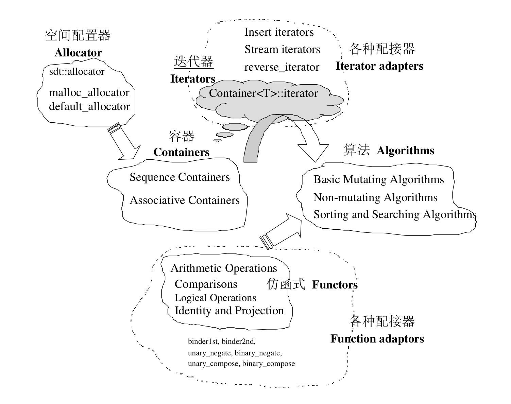

### STL的六大部件
1. 容器-containers：eg.vector,list,deque,set,map, etc. 容器其实是一种`class template`。
2. 算法-algorithms: 算法是一种`function template`。
3. 迭代器-iterator
4. 仿函数-functors：functor其实是重载了`operator()`的类或者`class template`。
5. 适配器-adapters: 一种用来修饰containers或functors或iterators接口的东西。如queue、stack，底层都是用deque实现，算是一种容器适配器。
6. 分配器-allocators：负责空间配置和管理，其实是一个实现了动态空间配置等的class template。

### 总览图

观察上图可以得到：

* container通过allocator取得存储空间
* algorithm通过iterator获取container的内容
* functor可以协助algorithm完成不同的策略变化
* adaptor可以协助iterator和algorithm，分别称为iterator adaptor和function adaptor

