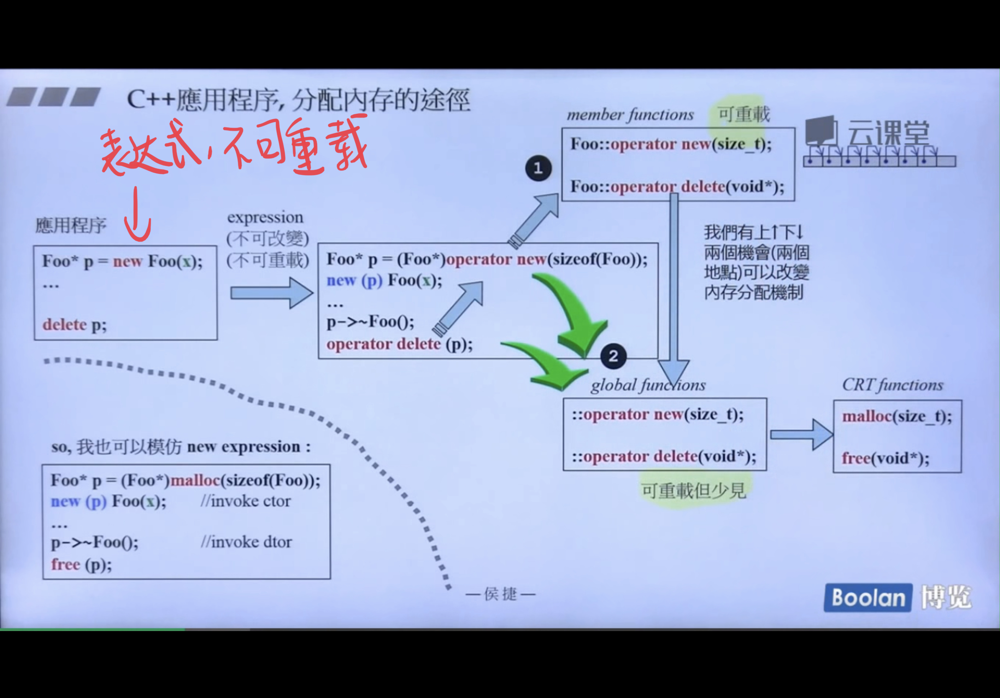
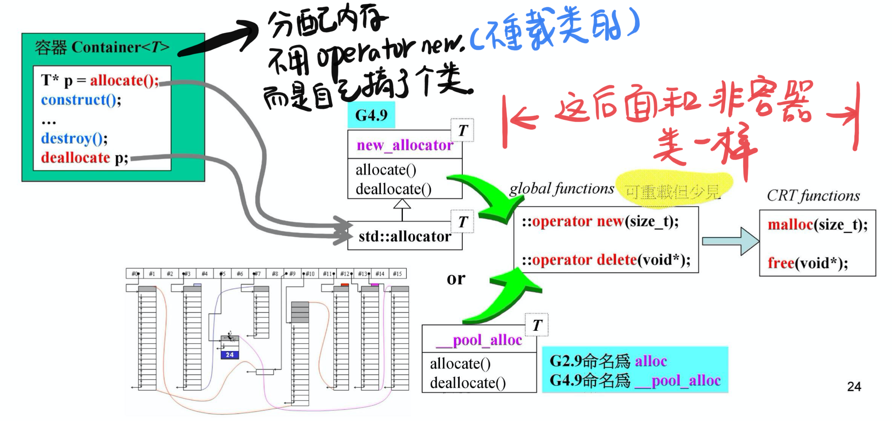

## 内存管理-v2

### C++程序分配内存的途径



说明：

1. 首先`new`是一个表达式，因此是不可以重载的。当我们使用`Foo* p = new Foo(x);`时，编译器都会进入以下两个函数：

   ```cpp
   Foo* p = (Foo*)operator new(sizeof(Foo));
   new(p) Foo(x);
   ```

   因为是函数，所以是可以重载的。

2. `operator new`的路径有两条，默认是走全局的，但是我们可以选择重载类的`operator new`，改变内存的走向，但是无论如何，都会经过`::operator new`进入`malloc`中。

### C++容器 分配内存的途径




### 重载`::operator new`和`::operator delete`的例子

代码如下：

```cpp
void* my_malloc(size_t size) {
  return malloc(size);
}

void my_free(void* ptr) {
  free(ptr);
}

// 下面两个都不能被声明在namesapce中
// 重载一下::operator new && ::operator delete
inline void* operator new(size_t size) {
  // 验证是否被接管
  cout << "sanjay global new()" << endl;
  return my_malloc(size);
}

inline void operator delete(void* ptr){
  cout << "sanjay global delete()" << endl;
  my_free(ptr);
}

// 主函数执行：
int* p = new int;
delete p;


// output：
sanjay global new()
sanjay global delete()
```

以上代码执行结果证明，全局的`operator new && delete`确实被我们接管了。


### 重载类内`operator new`和`operator delete`的例子

```cpp
class Foo{
public:
  int id_;
  Foo() : id_(0) {cout << "default ctor" << endl;}
  ~Foo() { cout << "dtor " << endl;}

  // 这里不写static也可以，因为编译器会自动帮我们加上
  static void* operator new(size_t size);
  static void operator delete(void* pdead, size_t size);
};
void *Foo::operator new(size_t size) {
  Foo* p = (Foo*)malloc(size);
  cout << "foo operator new" << endl;
  return p;
}
void Foo::operator delete(void *pdead, size_t size) {
  cout << "foo operator delete" << endl;
  free(pdead);
}

void test() {
  Foo* p = new Foo;
  delete p;

  // 下面是强制使用global 的operator new
  Foo* p1 = ::new Foo;
  ::delete p1;
}
```

输出结果是：

```shell
foo operator new
default ctor
# 先调用析构，再释放内存
dtor 
foo operator delete
# 调用全局的
default ctor
dtor 
```

### 重载`new()`和`delete()`

这个也就是重载类的成员函数`operator new 和 delete`，但是，重载的第一个参数必须为`size_t`类型，其余参数以new所指定的placement argument作为初值，出现在`new(...)`小括号内的便是所谓的placement arguments了。如：

`Foo* pf = new(200, 'c')Foo;`

可以重载类内成员函数operator delete()，但是不会调用delete，因为实际上重载operator new是没有分配内存的。

🌰：

```cpp
// 在Foo的基础上增加的
class Foo{
 public:
  //...
  // 重载operator new
  static void*operator new(size_t size, void* start);
  static void operator delete(void*, void*);
};

void *Foo::operator new(size_t size, void *start) {
  cout << "Foo::operator new(size_t, void*)" << endl;
  return start;
}
void Foo::operator delete(void *, void *) {
  cout << "Foo::operator delete" << endl;
}

// 测试
void test_new() {
  Foo start;
  Foo* p1 = new Foo;
  Foo* p2 = new(&start)Foo;
}
```

输出结果为：

```shell
# Foo start的输出
default ctor
# Foo* p1 = new Foo;的输出
foo operator new
default ctor
# Foo* p2 = new(&start)Foo;
Foo::operator new(size_t, void*)
default ctor # 会触发构造函数
# start栈的释放
dtor
```

**注意到，placement new会触发构造函数。**

