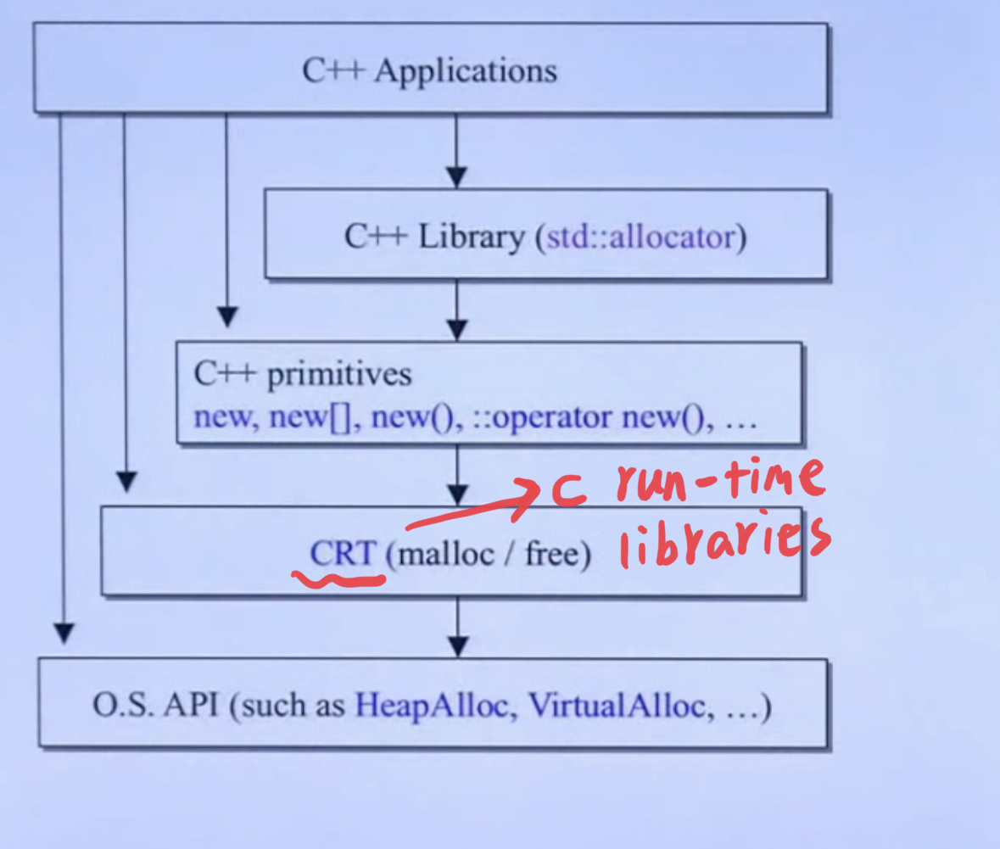

## 内存管理-v1

### C++内存调用一览图



* C++内存管理的原始方法

  | 分配                     | 释放                       | 类属           | 可否重载      |
  | ------------------------ | -------------------------- | -------------- | ------------- |
  | malloc()                 | free()                     | C funtction    | no            |
  | new                      | delete                     | C++ expression | no            |
  | ::operator new()         | ::operator delete()        | C++ function   | yes           |
  | allocator<T>::allocate() | allocator<T>::deallocate() | C++ STL        | use as u like |

* 测试代码

  ```cpp
  namespace memory_test{
  void test() {
    // 1. 使用c函数
    void* p1 = malloc(512); // 申请512 bytes
    free(p1);
  
    // 2. 使用c++表达式
    vector<int>* p2 = new vector<int>;
    delete p2;
  
    // 3. 使用c++函数
    void* p3 = ::operator new(512); // 512 个字节
    ::operator delete(p3);
  
    // 4. 使用标准库提供的allocator
  #ifdef __GNUC__
    // non-static function, 要通过object来调用
    void* p4 = allocator<int>().allocate(7); // 分配7个int
    allocator<int>().deallocate((int*)p4, 7);
    cout << "yes" << endl;
  
  #endif
  }
  }
  ```


### new expression

当我们写了：`vector<int>* p_v = new vector<int>();`时，编译器会做下面三件事：

1. 使用`operator new`申请内存
2. 使用`cast`进行指针的类型转换
3. 调用类的构造函数

用代码展示如下：

```cpp
vector<int> *p_v;
try{
  // 1. 申请内存
  void* mem = ::operator new(sizeof(vector<int>));
  // 2. 转换指针
  p_v = static_cast<vector<int>*>(mem);
  // 3. 调用构造函数
  p_v->vector<int>::vector(1);  // 这种只有编译器才可以调用
}
catch (std::bad_alloc){
  cout << "alloc fail" << endl;
}
// 以上代码我使用clang++ 11.0.0编译不过
```

`operator new`我在`gnu 4.9`中的`${你自己的路径}/gcc-4.9.2/libstdc++-v3/libsupc++/new_op.cc`找到了，源码如下： 

```cpp
void *
operator new (std::size_t sz) _GLIBCXX_THROW (std::bad_alloc)
{
  void *p;

  /* malloc (0) is unpredictable; avoid it.  */
  if (sz == 0)
    sz = 1;
  p = (void *) malloc (sz);
  // 这里是当p申请不到内存是，进入
  while (p == 0)
    {
      // 处理函数：候捷老师说这是释放部分内存
      new_handler handler = std::get_new_handler ();
      if (! handler)
	_GLIBCXX_THROW_OR_ABORT(bad_alloc());
      handler ();
      // 重新申请
      p = (void *) malloc (sz);
    }

  return p;
}
```

### delete expression

和new同理，当我们调用`delete`时，编译器也会做如下事情：

1. 调用类的析构函数
2. 调用`operator delete`函数

如`delete p_v`，编译器会做如下事情：

```cpp
// 假设类为:
class Complex;
// 1. 调用析构函数
p_v->~Complex();

// 2. 调用operator delete
operator delete(p_v);
```

`operator delete`源码如下：

```cpp
void
operator delete(void* ptr) _GLIBCXX_USE_NOEXCEPT
{
  // 也是直接调用free函数
  std::free(ptr);
}
```

### array new 和 array delete

* array new 和array delete源码如下：

  ```cpp
  void *ptr;
  void * operator new[] (std::size_t s)
  {
    ptr = operator new (s);
    return ptr;
  }
  
  void operator delete[] (void *p) throw ()
  {
    if (p == ptr)
      ret = 0;
    operator delete (p);
  }
  ```

  从代码上来开，其实内部只是调用了`operator new `和`operator delete`。这里暂不细说。

### placement new

* placement new 允许我们将object构建在已经分配的内存中
* 没有placement delete，因为placement new根本没分配内存(其实也可以有，但是函数是不做任何事情)

`placememt new`的源码：

```cpp
// Default placement versions of operator new.
inline void* operator new(std::size_t, void* __p) _GLIBCXX_USE_NOEXCEPT
{ return __p; }
```

例子：

```cpp
void test() {
  char* buf = new char[sizeof(string)*3];
  string* ps = new(buf)string("123");
  //...
  delete [] buf;
}
```

代码`string* ps = new(buf)string("123");`编译器会转换成以下形式：

```cpp
string* ps;
try {
  // 1. 使用placement new
  void* mem = operator new(sizeof(string), buf);
  // 2. 指针转换
  ps = static_cast<string*>(mem);
  // 3. 调用构造函数
  ps->string::string("123");
}
catch (std::bad_alloc){
 	// 失败
}
```

