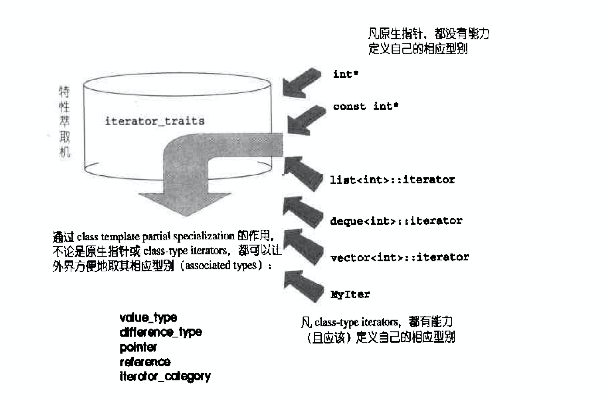

* iterator的设计

  假设要设计一个list的iterator，使得可以传进算法find()中进行值的寻找。

  下面是我们的初始设计：

  ```cpp
  // iterator的设计
  namespace List{
    template <typename T>
    class ListItem;
    // iterator是一种智能指针
    template <typename T>
    class List{
    public:
      void insert_front(T value);
      void insert_back(T value);
      void display(ostream& os = cout) const; // 输出到屏幕
      //...
    private:
      ListItem<T>* _end;
      ListItem<T>* _front;
      long _size;
    };
    template <typename T>
    class ListItem{
    public:
      T value() const {return _value;}
      ListItem* next() const { return _next;}
    private:
      T _value;
      ListItem* _next;
    };
    // 设计一个List的迭代器
    template <typename Item>
    struct ListIter{
      Item* ptr_;  // 与智能指针类似，需要一个容器的指针，保持与容器的联系
      //构造函数
      ListIter(Item* p = 0)
      : ptr_(p) {}
      //复制和赋值构造函数采用默认的即可
      Item&operator*(){ return *ptr_;}
      Item*operator->() {return ptr_;}
  
      //++, --
      ListIter& operator++() {
        ptr_ = ptr_->next(); return *this;
      }
      ListIter operator++(int) {
        ListIter tmp = *this;
        ++*this;
        return tmp;
      }
      bool operator==(const ListIter& i) const {
        return ptr_ == i.ptr_;
      }
      bool operator!=(const ListIter& i) const {
        return ptr_ != i.ptr_;
      }
    };
  
    // 使用ListIter将List和find联合
    void Link_ListIter_Find() {
      List<int> mylist;
      for(int i = 0; i < 5; ++i) {
        mylist.insert_front(i);
        mylist.insert_back(i + 2);
      }
      mylist.display();
  
      ListIter<ListItem<int>> begin(mylist.front());
      ListIter<ListItem<int>> end;
      ListIter<ListItem<int>> iter;
      iter = find(begin, end, 3);
      if(iter != end) {
        cout << "found" << endl;
      }
      else {
        cout << "not found " << endl;
      }
    }
  }
  ```

  在测试的例子中，我们发现，当我们使用设计的`IistIter`时，需要暴露`ListItem`；在`ListIter`中，为了实现`++`重载，又暴露了`ListItem`中的`next`函数。而原本`ListItem`是要完全隐藏起来的。这样以来，干脆把iterator的开发交给List的设计者就好了。显然这样的Iterator不是我们想要的。

* iterator设计要点

  在上面的例子中，发现迭代器很可能用到迭代器所指的相应类型。这就引入了traits的编程技法了。

  我们把迭代器所指对象类型，命名为`value_type`。但是如何用于返回值的类型推导呢？

  可以如下设计：

  ```cpp
  // 我们的iterator
  template <class T>
  struct MyIter{
    typedef T value_type;
    T* ptr;
    //...
  };
  
  // 返回值的推倒
  template <class T>
  typename T::value_type
  func(T ite) {
    return *ite;
  }
  ```

  注意上面的返回值必须加上关键词`typename`，因为T是一个template参数，在它被编译器实例化前，编译器对T一无所知。`typename`对用意是告诉编译器，这是一个类型，这样才能通过编译。

  * 仍存在的问题：不是所有的迭代器都是class type，原生指针就不是。而STL必须接受原生指针作为一种迭代器。

    解决：采用**偏特化（partial specialization）**的方法！

  ---

  下面就是萃取的关键实现：

  ```cpp
  namespace traits{
  template <class T>
  class iterator_traits{
    typedef typename T::value_type value_type;
  };
  
  // 偏特化版本
  template <class T>
  class iterator_traits<T*> {
    typedef T value_type;
  };
  
  // 针对const T* 版本，需要萃取出T
  template <class T>
  class iterator_traits<const T*> {
    typedef T value_type;
  };
  }
  ```

  图示：

  

  由上图，最常用到的迭代器类型分别有5种：

  1. value_type
  2. different_type
  3. pointer
  4. reference
  5. iterator_category

