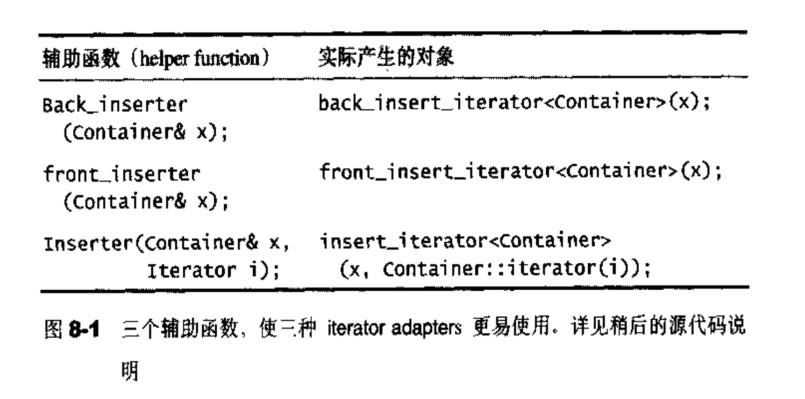
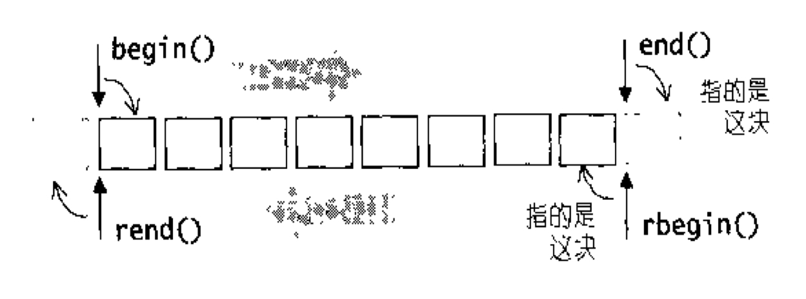
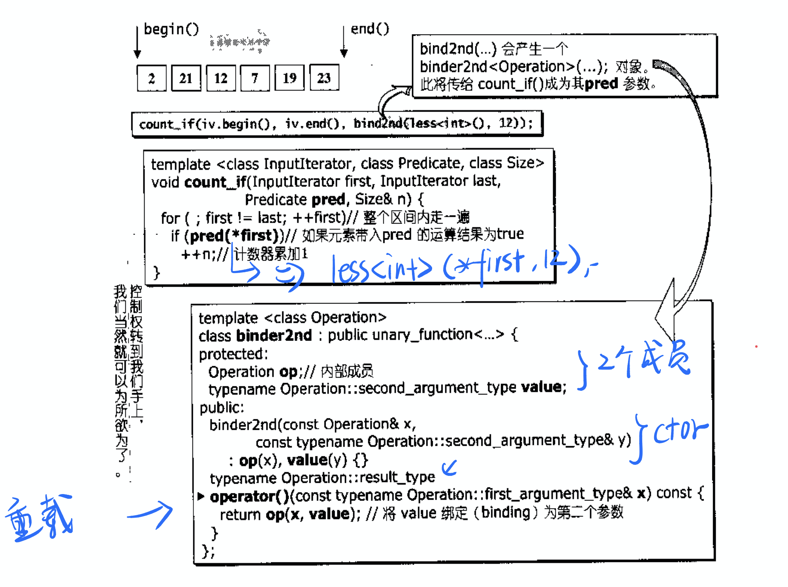

## 配接器-adapters

* 分类

  * function adapter 

    * 配接器族群中数量最庞大的一个

    * 配接操作包括：bind（绑定）、negate（否定）、compose（组合）等

    * 如：找出“不小于”12的元素个数

      `not1(bind2nd(less<int>(), 12))`

  * container adapter

    * 如：queue和stack只是一种adapter，内部修饰了deque

  * iterator adapter

    * 如：insert iterators，reverse iterators etc.
    * insert itegrators可以将一般迭代器的赋值（assign）操作变为插入（insert）操作。

* Iterator adapter细节

  * STL提供的三个辅助函数(仅是插入的)

    

  * back_insert_iterator源码

    ```cpp
    template <class _Container>
    class back_insert_iterator {
    protected:
      _Container* container;
    public:
      typedef _Container          container_type;
      typedef output_iterator_tag iterator_category;
      typedef void                value_type;
      typedef void                difference_type;
      typedef void                pointer;
      typedef void                reference;
    
      // 这个ctor将back_insert_iterator与container绑定
      explicit back_insert_iterator(_Container& __x) : container(&__x) {}
      back_insert_iterator<_Container>&
      operator=(const typename _Container::value_type& __value) { 
        container->push_back(__value);	// 将=号重载为push_back
        return *this;
      }
      back_insert_iterator<_Container>& operator*() { return *this; }
      back_insert_iterator<_Container>& operator++() { return *this; }
      back_insert_iterator<_Container>& operator++(int) { return *this; }
    };
    ```

    下面的辅助函数帮我们调用`back_insert_iterator`:

    ```cpp
    template <class _Container>
    inline back_insert_iterator<_Container> back_inserter(_Container& __x) {
      return back_insert_iterator<_Container>(__x);
    }
    ```

    ---

    来一个例子测试一下：

    ```cpp
    #include <iterator>
    #include <vector>
    namespace test_back_inserter{
    void test() {
      vector<int> v {1,2,3};
      v[0] = 3;
      // output: 3 2 3 
      for(auto e : v){
        cout << e << " ";
      }
      cout << endl;
      // 这里通过adapter变成了push_back
      back_inserter(v) = 5;
      
      // output: 3 2 3 5 
      for(auto e : v){
        cout << e << " ";
      }
      cout << endl;
    }
    }
    ```

  * reverse iterators

    * 将迭代器的移动行为倒转

    * 看看`vector`类中的成员函数：

      ```cpp
      template <class _Tp, class _Alloc = __STL_DEFAULT_ALLOCATOR(_Tp) >
      class vector : protected _Vector_base<_Tp, _Alloc> 
      {
      private:
        typedef _Vector_base<_Tp, _Alloc> _Base;
      public:
        typedef _Tp value_type;
        typedef value_type* pointer;
        typedef const value_type* const_pointer;
        typedef value_type* iterator;
        typedef const value_type* const_iterator;
        typedef value_type& reference;
        typedef const value_type& const_reference;
        typedef size_t size_type;
        typedef ptrdiff_t difference_type;
      	// 注意下面：只有双向序列容器才有，stack、queue、priority_queue并不具有。
        typedef reverse_iterator<const_iterator> const_reverse_iterator;
        typedef reverse_iterator<iterator> reverse_iterator;
        reverse_iterator rbegin()
          { return reverse_iterator(end()); }
        const_reverse_iterator rbegin() const
          { return const_reverse_iterator(end()); }
        reverse_iterator rend()
          { return reverse_iterator(begin()); }
        const_reverse_iterator rend() const
          { return const_reverse_iterator(begin()); }
      ...
      };
      ```

    * 图示：

      

    * 下面是`reverse_iterator`的源码

      ```cpp
      template <class _Iterator>
      class reverse_iterator
      {
      protected:
        _Iterator current;  // 记录对应的正向迭代器
      public:
        typedef typename iterator_traits<_Iterator>::iterator_category
                iterator_category;
        typedef typename iterator_traits<_Iterator>::value_type
                value_type;
        typedef typename iterator_traits<_Iterator>::difference_type
                difference_type;
        typedef typename iterator_traits<_Iterator>::pointer
                pointer;
        typedef typename iterator_traits<_Iterator>::reference
                reference;
      
        typedef _Iterator iterator_type;  // 代表正向迭代器
        typedef reverse_iterator<_Iterator> _Self;  // 逆向迭代器
      
      public:
        reverse_iterator() {}
        // 与某个迭代器联系起来
        explicit reverse_iterator(iterator_type __x) : current(__x) {}
      
        reverse_iterator(const _Self& __x) : current(__x.current) {}
      #ifdef __STL_MEMBER_TEMPLATES
        template <class _Iter>
        reverse_iterator(const reverse_iterator<_Iter>& __x)
          : current(__x.base()) {}
      #endif /* __STL_MEMBER_TEMPLATES */
        // 取出对应的正向迭代器
        iterator_type base() const { return current; }
        // 下面是关键所在，当取*时，是反向迭代器前面的元素
        reference operator*() const {
          _Iterator __tmp = current;
          return *--__tmp;
        }
      #ifndef __SGI_STL_NO_ARROW_OPERATOR
        pointer operator->() const { return &(operator*()); }
      #endif /* __SGI_STL_NO_ARROW_OPERATOR */
      
        // ++变--
        _Self& operator++() {
          --current;
          return *this;
        }
      ...
      };
      ```

  * stream iterators(略)

* function iterators

  * 鸟瞰`count_if()`和`bind2nd(less<int>(), 12)`的搭配实例：

    

  * `bind1st`和`bind2nd`：对参数进行绑定

    * 源码：

      ```cpp
      template <class _Operation> 
      class binder1st
        : public unary_function<typename _Operation::second_argument_type,
                                typename _Operation::result_type> {
      protected:
        _Operation op;
        typename _Operation::first_argument_type value;
      public:
        binder1st(const _Operation& __x,
                  const typename _Operation::first_argument_type& __y)
            : op(__x), value(__y) {}
        typename _Operation::result_type
        operator()(const typename _Operation::second_argument_type& __x) const {
          return op(value, __x); 	// 实际调用表达式，并将value绑定为第一个参数
        }
      };
      
      // 此函数方便我们调用上面类对象
      template <class _Operation, class _Tp>
      inline binder1st<_Operation> 
      bind1st(const _Operation& __oper, const _Tp& __x) 
      {
        typedef typename _Operation::first_argument_type _Arg1_type;
        return binder1st<_Operation>(__oper, _Arg1_type(__x));
        // 上面的_Arg1_type(__x)：要把__x转为op的第一参数类型
      }
      
      // 下面同上
      template <class _Operation> 
      class binder2nd
        : public unary_function<typename _Operation::first_argument_type,
                                typename _Operation::result_type> {
      protected:
        _Operation op;
        typename _Operation::second_argument_type value;
      public:
        binder2nd(const _Operation& __x,
                  const typename _Operation::second_argument_type& __y) 
            : op(__x), value(__y) {}
        typename _Operation::result_type
        operator()(const typename _Operation::first_argument_type& __x) const {
          return op(__x, value); 
        }
      };
      
      template <class _Operation, class _Tp>
      inline binder2nd<_Operation> 
      bind2nd(const _Operation& __oper, const _Tp& __x) 
      {
        typedef typename _Operation::second_argument_type _Arg2_type;
        return binder2nd<_Operation>(__oper, _Arg2_type(__x));
      }
      ```

  * ptr_fun : 用于函数指针

    * 源码

      ```cpp
      template <class _Arg, class _Result>
      class pointer_to_unary_function : public unary_function<_Arg, _Result> {
      protected:
        // 记录函数指针
        _Result (*_M_ptr)(_Arg);
      public:
        pointer_to_unary_function() {}
        //与函数指针绑定
        explicit pointer_to_unary_function(_Result (*__x)(_Arg)) : _M_ptr(__x) {}
        // 调用
        _Result operator()(_Arg __x) const { return _M_ptr(__x); }
      };
      
      template <class _Arg, class _Result>
      inline pointer_to_unary_function<_Arg, _Result> 
      // 辅助函数，帮助更好调用上述类
      ptr_fun(_Result (*__x)(_Arg))
      {
        return pointer_to_unary_function<_Arg, _Result>(__x);
      }
      
      template <class _Arg1, class _Arg2, class _Result>
      class pointer_to_binary_function : 
        public binary_function<_Arg1,_Arg2,_Result> {
      protected:
          _Result (*_M_ptr)(_Arg1, _Arg2);
      public:
          pointer_to_binary_function() {}
          explicit pointer_to_binary_function(_Result (*__x)(_Arg1, _Arg2)) 
            : _M_ptr(__x) {}
          _Result operator()(_Arg1 __x, _Arg2 __y) const {
            return _M_ptr(__x, __y);
          }
      };
      
      template <class _Arg1, class _Arg2, class _Result>
      inline pointer_to_binary_function<_Arg1,_Arg2,_Result> 
      ptr_fun(_Result (*__x)(_Arg1, _Arg2)) {
        return pointer_to_binary_function<_Arg1,_Arg2,_Result>(__x);
      }
      ```

  * `mem_fun`, `mem_fun_ref` : 用于成员函数指针

    * 这个族群一共有8个(2^3):

      * 无参数 vs. 有一个参数
      * 通过pointer调用 vs. 通过ref调用
      * const成员函数 vs. non-const成员函数

    * `无参数`-`通过pointer调用`-`non-const成员函数`源码

      ```cpp
      // 无参数调用
      template <class _Ret, class _Tp>
      class mem_fun_t : public unary_function<_Tp*,_Ret> {
      public:
        // 绑定
        explicit mem_fun_t(_Ret (_Tp::*__pf)()) : _M_f(__pf) {}
        // 调用
        _Ret operator()(_Tp* __p) const { return (__p->*_M_f)(); }
      private:
        _Ret (_Tp::*_M_f)();  // 内部成员，记录类成员函数指针
      };
      
      // 辅助函数
      template <class _Ret, class _Tp>
      inline mem_fun_t<_Ret,_Tp> mem_fun(_Ret (_Tp::*__f)())
        { return mem_fun_t<_Ret,_Tp>(__f); }
      ```

      

      

